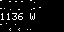
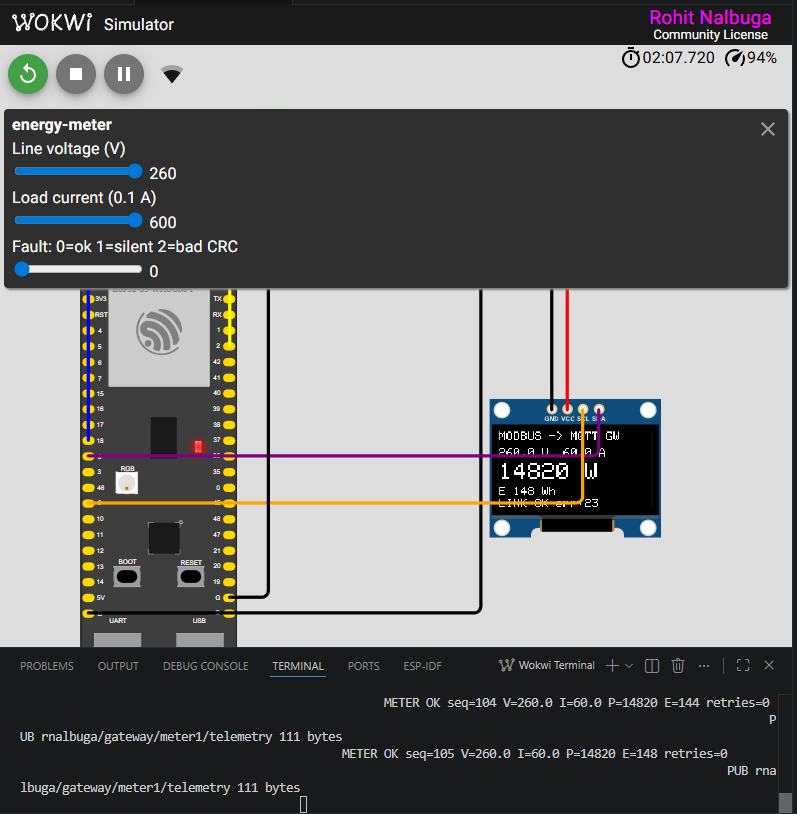
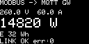
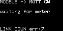

# Modbus RTU → MQTT industrial edge gateway

[](https://github.com/ADuetrohit/modbus-mqtt-gateway/actions/workflows/ci.yml)

An ESP32-S3 gateway that polls an AC energy meter over Modbus RTU and republishes
telemetry to MQTT — simulated end to end in Wokwi, and tested on every push.

That badge is not a build check. It means the firmware was flashed into a
simulated ESP32-S3, spoke Modbus to a simulated meter, survived that meter being
driven into failure, and published to a real broker — on GitHub's runners, on
this commit.

The meter is not a stock part. It is a **custom Wokwi chip written in C** that
speaks real Modbus RTU: CRC-16/MODBUS, t3.5 inter-frame framing, exception
responses, a response turnaround delay, and live energy integration. It can also
be told to fail on demand, which is what makes the CI meaningful.



*Live from the simulator: 230.0 V x 5.2 A decoded to 1136 W, energy integrating,
link healthy. Captured headless with `wokwi-cli --screenshot-part`.*



*The whole loop under load. The meter chip's sliders are pushed to 260 V and
60.0 A; the OLED reads 14820 W, which is 260.0 x 60.0 x 0.95 exactly. 105 polls
in, zero retries, publishing 111-byte payloads to the broker.*

## Why this exists

Field gateways fail on the boring paths: a slave goes quiet, a frame arrives
corrupted, the broker stalls. Those paths are the hardest to test against real
hardware and the easiest to test against a simulated meter you control. Here
they run in GitHub Actions on every commit.

## Architecture

```
  ┌─────────────── ESP32-S3 ───────────────┐
  │  core 0            core 1              │
  │  pollTask ──queue──> netTask ──MQTT──> broker.hivemq.com
  │     │                  uiTask ──I2C──> SSD1306
  │     │                                  │
  └─────┼──────────────────────────────────┘
        │ UART 9600 8N1
        ▼
  chip-energy-meter  (custom C chip, Modbus RTU slave @ addr 1)
```

`pollTask` is the only writer to the fieldbus and lives on core 0, away from the
Wi-Fi stack. It hands samples to `netTask` through a queue and never blocks on
the network — a wedged broker drops samples instead of stalling the bus.

## Input register map (function 0x04)

| Reg | Quantity | Scale |
|-----|----------|-------|
| 0 | Voltage | V ×10 |
| 1 | Current | A ×10 |
| 2–3 | Active power | W (u32) |
| 4 | Frequency | Hz ×10 |
| 5 | Power factor | ×100 |
| 6–7 | Active energy | Wh (u32) |

## The gateway under load, and under failure

| Healthy, heavy load | Meter stops answering |
|---|---|
|  |  |
| 260.0 V x 60.0 A x 0.95 = **14820 W**, exactly. Energy integrating, `err:0`. | `faultMode 1` — the meter goes silent. The gateway reports `LINK DOWN` and counts errors rather than freezing or showing a stale reading. |

Both captured headless with `wokwi-cli --screenshot-part`, no GUI involved.

## Fault injection

The chip's `faultMode` control drives the failure paths:

| Value | Behaviour | What it proves |
|-------|-----------|----------------|
| 0 | Healthy | Normal decode |
| 1 | Silent | Master times out, retries, recovers |
| 2 | Corrupted CRC | Master rejects the frame instead of publishing garbage |

## Build and run

```bash
# 1. Compile the custom chip to WASM (toolchain is fetched automatically)
wokwi-cli chip compile chips/energy-meter.chip.c -o chips/energy-meter.chip.wasm

# 2. Build the firmware
pio run

# 3. Simulate (needs WOKWI_CLI_TOKEN from https://wokwi.com/dashboard/ci)
wokwi-cli . --scenario test/meter-poll.scenario.yaml
wokwi-cli . --scenario test/fault-injection.scenario.yaml
wokwi-cli . --scenario test/mqtt-publish.scenario.yaml
```

## Tests

| Scenario | What it proves |
|----------|----------------|
| `meter-poll` | A real Modbus round trip decodes exactly: 230.0 V x 5.2 A x 0.95 = 1136 W |
| `fault-injection` | Timeout, retry, CRC rejection, and recovery — driven by the chip's fault modes |
| `mqtt-publish` | The cloud leg: Wi-Fi associates, broker connects, telemetry publishes |

Wokwi's simulated Wi-Fi reaches the real internet from the CLI, not only from the
browser, so the MQTT path is covered headless in CI rather than by hand.

For interactive use, open the folder in VS Code with the Wokwi extension and run
**Wokwi: Start Simulator**.

## CI

`.github/workflows/ci.yml` compiles the chip, builds the firmware, and runs both
scenarios headless. It needs a `WOKWI_CLI_TOKEN` repository secret, from
<https://wokwi.com/dashboard/ci>.

## Serial contract

The scenarios assert on these lines, so they are API:

```
BOOT modbus-mqtt-gateway
OLED OK
METER OK seq=<n> V=<v> I=<i> P=<w> E=<wh> retries=<n>
METER FAIL reason=<TIMEOUT|CRC_ERROR|EXCEPTION|BAD_REPLY> streak=<n>
WIFI OK ip=<addr>
MQTT OK
PUB <topic> <n> bytes
```
